## Prerequisites - Setup the environment

Download **vagrant** and install it on your computer.

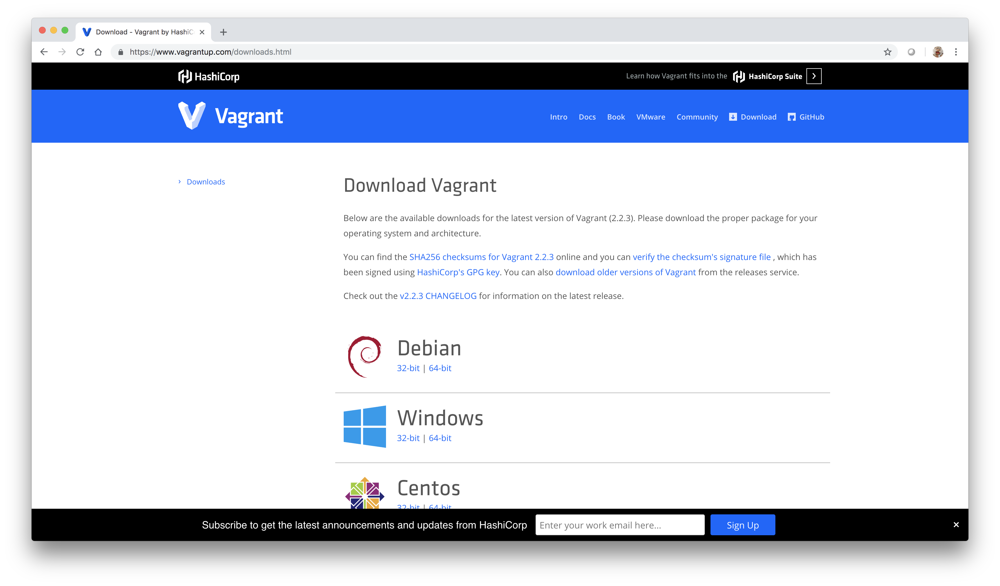

Execute these command From the command line 
```console
$ mkdir datadog
$ cd datatadog
$ vagrant init ubuntu/xenial64
$ vagrant up
$ vagrant ssh
```

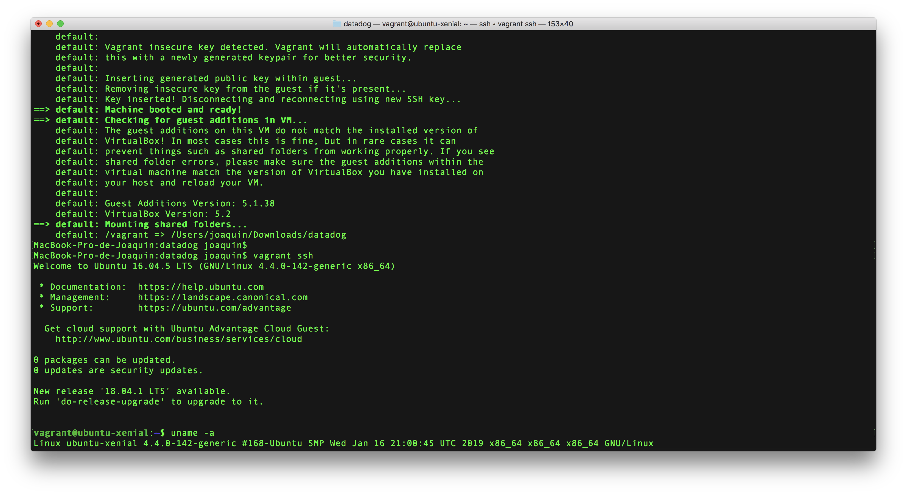

## Datadog Agent installation

Browse to <a href="https://app.datadoghq.com/signup ">Datadog sign up page</a> an fill the form:

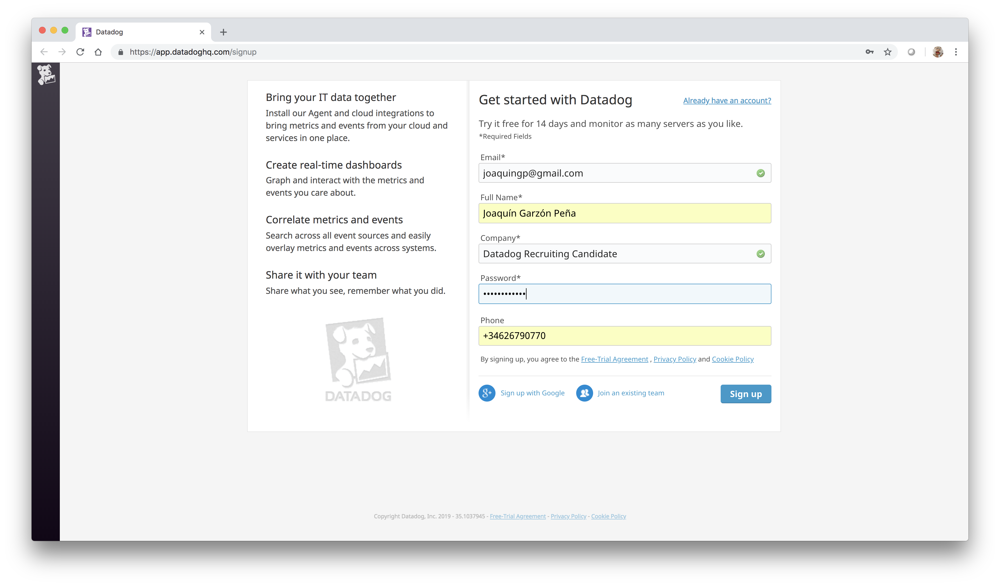

Optionally, you can inform about the stack that you plan to use:

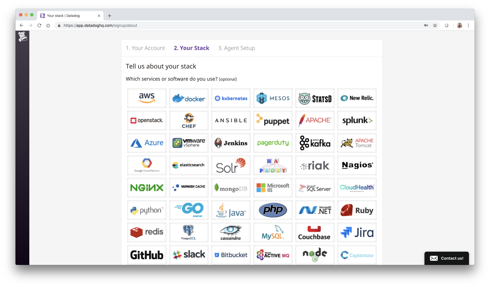
 
Choose your platform (Ubuntu in our example) and copy your DataDog installation command:

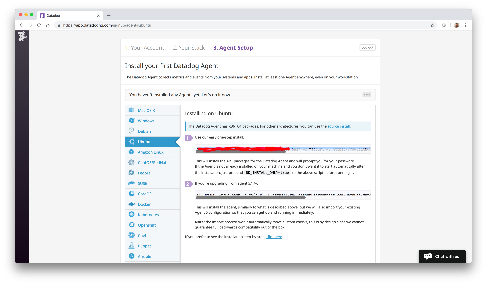

Paste the installation command in the *vagrant ssh* terminal:

```console
$ DD_API_KEY=<YOU_API_KEY_HERE> bash -c "$(curl -L https://raw.githubusercontent.com/DataDog/datadog-agent/master/cmd/agent/install_script.sh)"
```

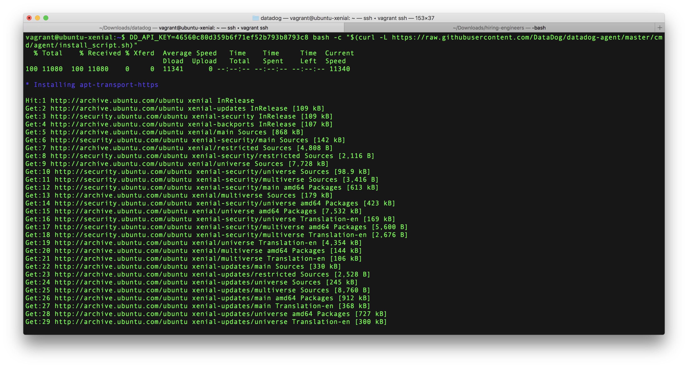

Wait until the agent installation is complete.

Now we can start working with DataDog:

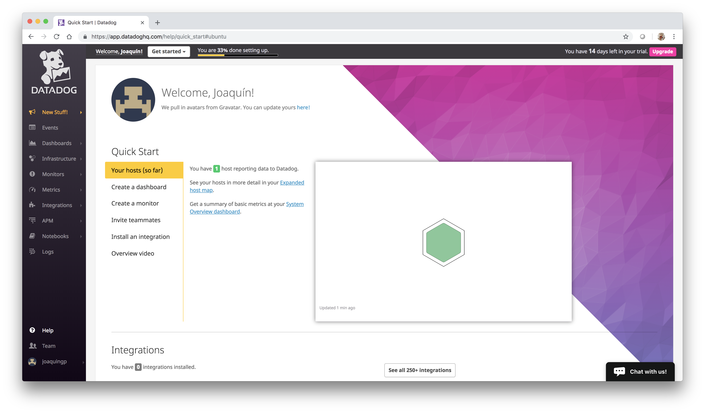

## Collecting Metrics:
### Add tags in the Agent config file and show us a screenshot of your host and its tags on the Host Map page in Datadog.

1. Browse to the folder **/etc/datadog-agent** and edit the file **datadog.yaml**
```console
$ cd /etc/datadog-agent
$ sudo nano datadog.yaml
```

2. Add this line:
```
tags: purpose:hiring, role:solutionsengineer, location:spain
```
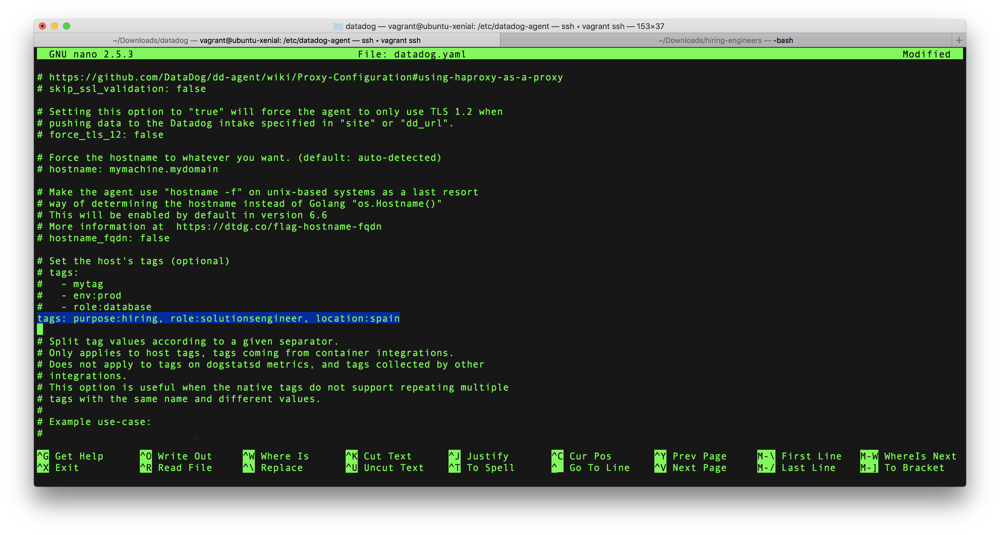

3. Restart your DataDog agent from the command line:
```console
$ sudo service datadog-agent restart
```

4. Click on **Events** option in you DataDog Admin panel. The new tags has been added:
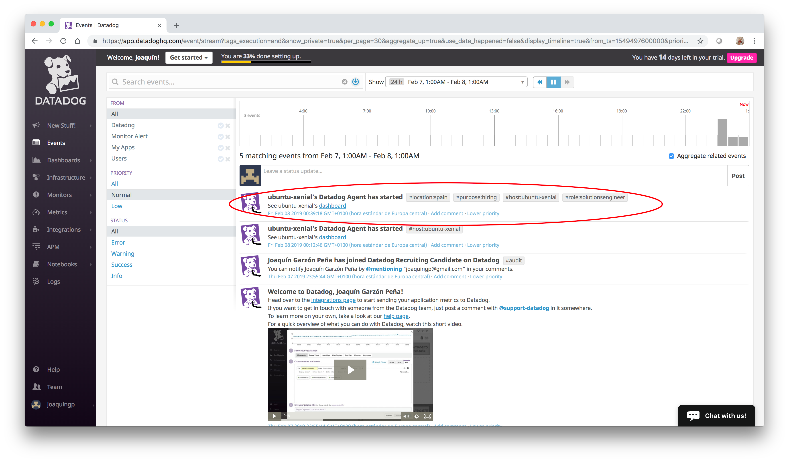
 
### Install a database on your machine (MongoDB, MySQL, or PostgreSQL) and then install the respective Datadog integration for that database.
1. Now we are going to install MongoDB

```console
$ sudo apt-key adv --keyserver hkp://keyserver.ubuntu.com:80 --recv 9DA31620334BD75D9DCB49F368818C72E52529D4

$ echo "deb [ arch=amd64,arm64 ] https://repo.mongodb.org/apt/ubuntu xenial/mongodb-org/4.0 multiverse" | sudo tee /etc/apt/sources.list.d/mongodb-org-4.0.list

$ sudo apt-get update

$ sudo apt-get install -y mongodb-org

$ echo "mongodb-org hold" | sudo dpkg --set-selections
$ echo "mongodb-org-server hold" | sudo dpkg --set-selections
$ echo "mongodb-org-shell hold" | sudo dpkg --set-selections
$ echo "mongodb-org-mongos hold" | sudo dpkg --set-selections
$ echo "mongodb-org-tools hold" | sudo dpkg --set-selections

$ sudo service mongod start
```

NOTE: See <a href="https://docs.mongodb.com/manual/tutorial/install-mongodb-on-ubuntu/"> Install MongoDB Community Edition on Ubuntu</a> for further instructions

2. We must create a configuration file called **mongo.yaml** file under the folder **/etc/datadog-agent/conf.d/mongo.d/**

```console
$ cd /etc/datadog-agent/conf.d/mongo.d/
$ sudo nano mongo.yaml
```

This is the content added to **mongo.yaml** config file:

```
init_config:
instances:
    - server: mongodb://localhost:27017/admin
```

3. Set **dd-agent** as user and group owners  
```console
$ sudo chown dd-agent:dd-agent mongo.yaml
```

4. restart the agent.
```console
$ sudo service datadog-agent restart
```

5. Check the agent status. MongoDB must be up & running
```console
sudo datadog-agent status
```
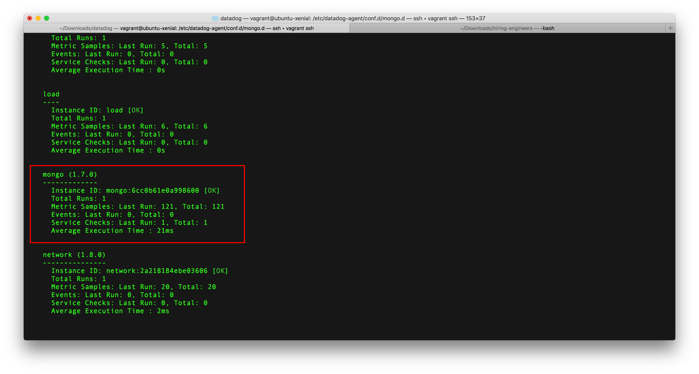

6. Click on **Integrations** option in the DataDog admin panel
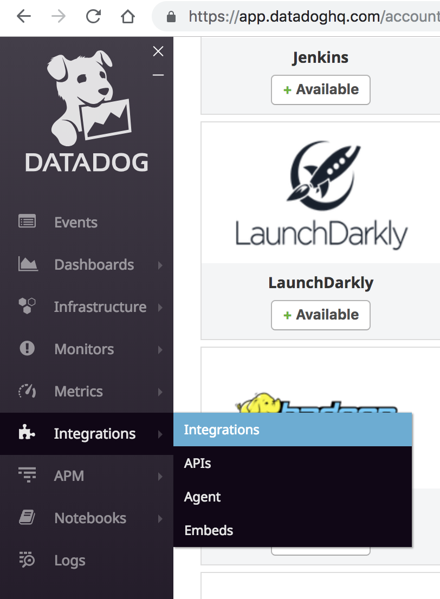 

7. Select **MongoDB** integration and click on Install
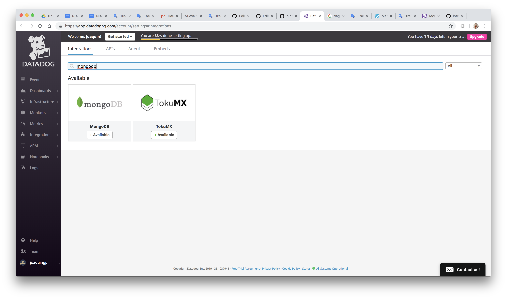

8. Follow the instructions given in the pop-up:


9. Click on **Dashboards** *(in the DataDog Admin Panel)* and select **MongoDB Overview**. You will see different graphics about MongoDB metrics:

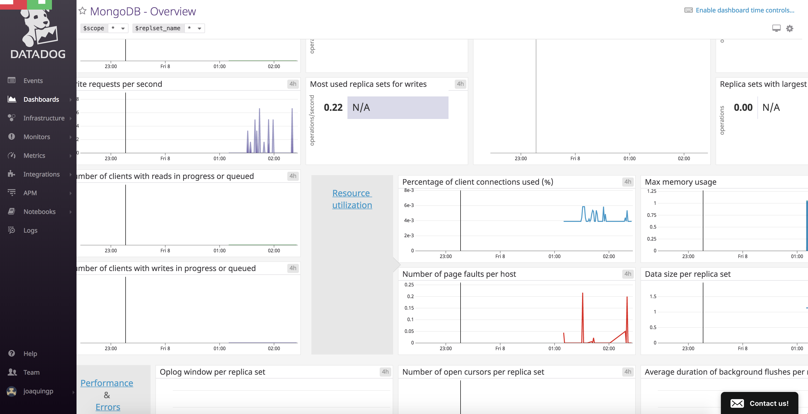

### Create a custom Agent check that submits a metric named my_metric with a random value between 0 and 1000.

1. Browse to **/etc/datadog-agent/conf.d/** folder and create a file called **customagent.yaml** 

```console
$ cd /etc/datadog-agent/conf.d/
$ nano hello.yaml
```

2. Write this code in the file:
```console
instances: [{}]
```

3. Browse to **/etc/datadog-agent/checks.d/** folder and create a file called **customagent.py** 

```console
$ cd /etc/datadog-agent/conf.d/
$ nano hello.py
```

4. Write this code in the file:
```python
# the following try/except block will make the custom check compatible with any Agent version
try:
    # first, try to import the base class from old versions of the Agent...
    from checks import AgentCheck
except ImportError:
    # ...if the above failed, the check is running in Agent version 6 or later
    from datadog_checks.checks import AgentCheck

from random import uniform

# content of the special variable __version__ will be shown in the Agent status page
__version__ = "1.0.0"


class HelloCheck(AgentCheck):
    def check(self, instance):
        self.gauge('hello.world', uniform(0, 1000))
```

5. Change the user and group ownership of both files
```console
$ sudo chown dd-agent:dd-agent hello.yaml 
$ sudo chown dd-agent:dd-agent hello.py 
```
6. Verify that the check is running 

```
sudo datadog-agent check hello
```
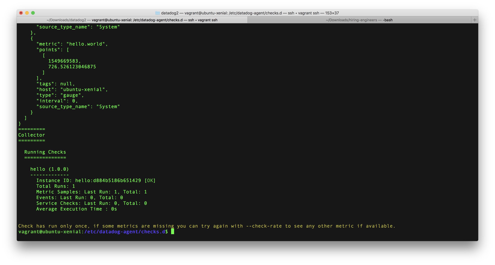 


### Change your check's collection interval so that it only submits the metric once every 45 seconds.
### **Bonus Question** Can you change the collection interval without modifying the Python check file you created?


