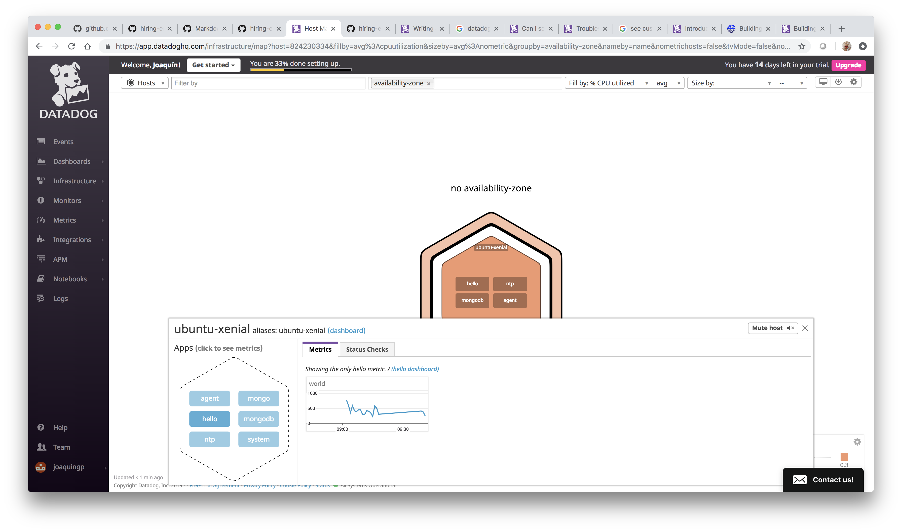

## Prerequisites - Setup the environment

Download **vagrant** and install it on your computer.


Execute these command From the command line 
```console
$ mkdir datadog
$ cd datatadog
$ vagrant init ubuntu/xenial64
$ vagrant up
$ vagrant ssh
```


## Datadog Agent installation

Browse to <a href="https://app.datadoghq.com/signup ">Datadog sign up page</a> an fill the form:


Optionally, you can inform about the stack that you plan to use:


 
Choose your platform (Ubuntu in our example) and copy your DataDog installation command:


Paste the installation command in the *vagrant ssh* terminal:

```console
$ DD_API_KEY=<YOU_API_KEY_HERE> bash -c "$(curl -L https://raw.githubusercontent.com/DataDog/datadog-agent/master/cmd/agent/install_script.sh)"
```


Wait until the agent installation is complete.

Now we can start working with DataDog:


## Collecting Metrics:
### Add tags in the Agent config file and show us a screenshot of your host and its tags on the Host Map page in Datadog.

1. Browse to the folder **/etc/datadog-agent** and edit the file **datadog.yaml**
```console
$ cd /etc/datadog-agent
$ sudo nano datadog.yaml
```

2. Add this line:
```
tags: purpose:hiring, role:solutionsengineer, location:spain
```


3. Restart your DataDog agent from the command line:
```console
$ sudo service datadog-agent restart
```

4. Click on **Events** option in you DataDog Admin panel. The new tags has been added:

 
### Install a database on your machine (MongoDB, MySQL, or PostgreSQL) and then install the respective Datadog integration for that database.
1. Now we are going to install MongoDB

```console
$ sudo apt-key adv --keyserver hkp://keyserver.ubuntu.com:80 --recv 9DA31620334BD75D9DCB49F368818C72E52529D4

$ echo "deb [ arch=amd64,arm64 ] https://repo.mongodb.org/apt/ubuntu xenial/mongodb-org/4.0 multiverse" | sudo tee /etc/apt/sources.list.d/mongodb-org-4.0.list

$ sudo apt-get update

$ sudo apt-get install -y mongodb-org

$ echo "mongodb-org hold" | sudo dpkg --set-selections
$ echo "mongodb-org-server hold" | sudo dpkg --set-selections
$ echo "mongodb-org-shell hold" | sudo dpkg --set-selections
$ echo "mongodb-org-mongos hold" | sudo dpkg --set-selections
$ echo "mongodb-org-tools hold" | sudo dpkg --set-selections

$ sudo service mongod start
```

NOTE: See <a href="https://docs.mongodb.com/manual/tutorial/install-mongodb-on-ubuntu/"> Install MongoDB Community Edition on Ubuntu</a> for further instructions

2. We must create a configuration file called **mongo.yaml** file under the folder **/etc/datadog-agent/conf.d/mongo.d/**

```console
$ cd /etc/datadog-agent/conf.d/mongo.d/
$ sudo nano mongo.yaml
```

This is the content added to **mongo.yaml** config file:

```
init_config:
instances:
    - server: mongodb://localhost:27017/admin
```

3. Set **dd-agent** as user and group owners  
```console
$ sudo chown dd-agent:dd-agent mongo.yaml
```

4. restart the agent.
```console
$ sudo service datadog-agent restart
```

5. Check the agent status. MongoDB must be up & running
```console
sudo datadog-agent status
```


6. Click on **Integrations** option in the DataDog admin panel
 

7. Select **MongoDB** integration and click on Install


8. Follow the instructions given in the pop-up:


9. Click on **Dashboards** *(in the DataDog Admin Panel)* and select **MongoDB Overview**. You will see different graphics about MongoDB metrics:


### Create a custom Agent check that submits a metric named my_metric with a random value between 0 and 1000.

1. Browse to **/etc/datadog-agent/conf.d/** folder and create a file called **checkvalue.yaml** 

```console
$ cd /etc/datadog-agent/conf.d/
$ sudo nano checkvalue.yaml
```

2. Write this code in the file:
```console
init_config:

instances:
  [{}]
```

3. Change the user and group ownership of both files
```console
$ sudo chown dd-agent:dd-agent checkvalue.py.yaml 
```

4. Browse to **/etc/datadog-agent/checks.d/** folder and create a file called **hello.py** 

```console
$ cd /etc/datadog-agent/checks.d/
$ sudo nano checkvalue.py
```

5. Write this code in the file:
```python
from checks import AgentCheck
class HelloCheck(AgentCheck):
  def check(self, instance):
    self.gauge('hello.world', 1)
```

6. Change the user and group ownership of both files
```console
$ sudo chown dd-agent:dd-agent checkvalue.py 
```
7. Verify that the check is running 

```
sudo datadog-agent check checkvalue
```
 

8. Check the metrica in Datadog
 


**NOTE:** Visit <a href="https://docs.datadoghq.com/developers/write_agent_check/?tab=agentv6">Writing a custom Agent check</a> for further details.

### Change your check's collection interval so that it only submits the metric once every 45 seconds.

1. Browse to **/etc/datadog-agent/checks.d/** folder and create a file called **customagent.py** 

```console
$ cd /etc/datadog-agent/conf.d/
$ sudo nano checkvalue.py.yaml
```

2. Add these lines at the end of the file
```console
init_config:

instances:
  - min_collection_interval: 45
```

### **Bonus Question** Can you change the collection interval without modifying the Python check file you created?

Acording to the documentation it's not required to modify the phyton file to modify the collection interval, just set the **min_collection_interval** parameter in the **.yaml** file.


## Visualizing Data:
### Utilize the Datadog API to create a Timeboard 
1. Browse to **Integrations > APIs** option in the Datadog page:

 

2. Provide a name for the application key, e.g. "hiring"
3. Click on the **Create application key** button
4. This is the curl command that we must execute from the comman line:
```console
curl  -X POST -H "Content-type: application/json" \
    -d '{
	      "graphs" : [{
	  "title": "My Custom Check",
	  "definition": {
	    "viz": "timeseries",
	    "requests": [{"q": "avg:custom.hello{host:ubuntu-xenial}"}] 
	    }  	
	  },
	  {
	  "title": "WT Dirty Bytes (Anomalies)",
	  "definition": {
	    "viz": "timeseries",
	    "requests": [{"q":"anomalies(avg:mongodb.wiredtiger.cache.tracked_dirty_bytes_in_cache{server:mongodb://localhost:27017/admin}, \u0027basic\u0027, 2)"}] 
	    }
	  },
	  {
	  "title": "My Custom Check (1h Buckets)",
	  "definition": {
	    "viz": "timeseries",
	    "type":"bars",
	    "requests": [{"q": "avg:custom.hello{host:ubuntu-xenial}.rollup(sum,3600)"}] 
	    }
	  }],
      "title" : "My Custom Timeboard",
      "description" : "Basic timeboard over my custom check and some MongoDB variables",
      "read_only": "True"
    }' \
    "https://api.datadoghq.com/api/v1/dash?api_key=<API_KEY>&application_key=<APPLICATION_KEY>"
```

### Set the Timeboard's timeframe to the past 5 minutes
### Take a snapshot of this graph and use the @ notation to send it to yourself.
### Bonus Question: What is the Anomaly graph displaying?


