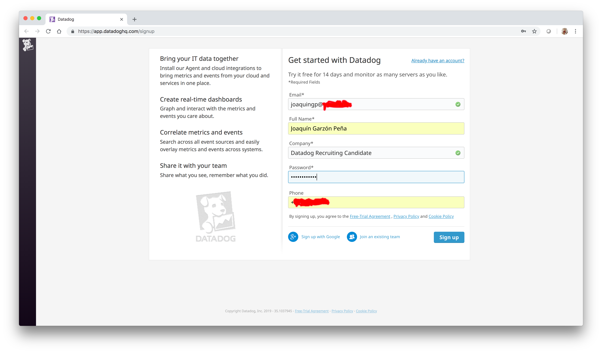

## Prerequisites - Setup the environment

Download vagrant and install it on your computer.


Execute these command From the command line 
```console
$ mkdir datadog
$ cd datatadog
$ vagrant init ubuntu/xenial64
$ vagrant up
$ vagrant ssh
```


## Datadog Agent installation

Browse to <a href="https://app.datadoghq.com/signup ">Datadog sign up page</a> an fill the form:



Optionally, you can inform about the stack that you plan to use:


 
Choose your platform and copy you DataDog API KEY:


